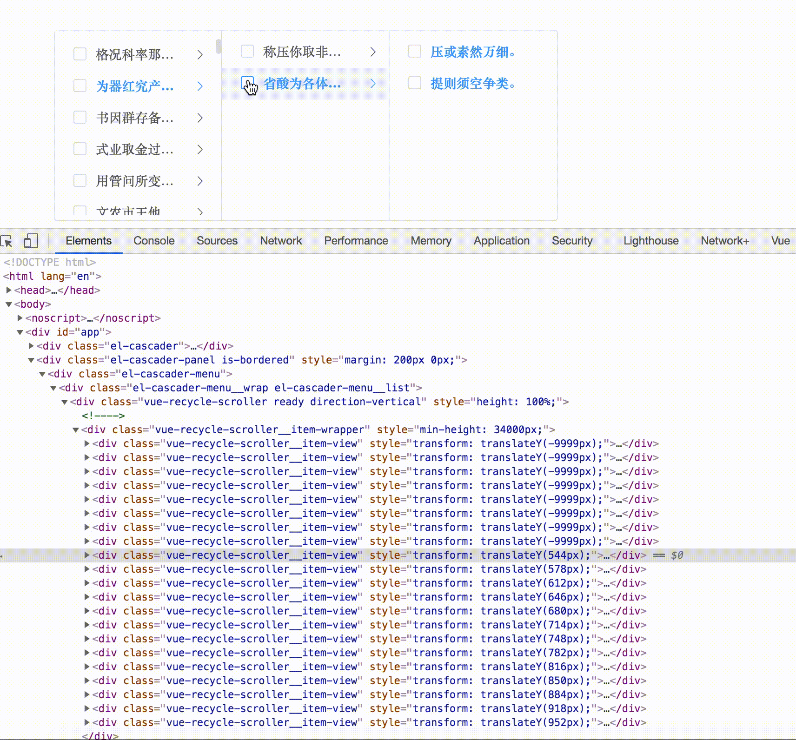

<p align="center">
    <h3 align="center">lazy-cascader</h3>
    <br>
    <p align="center">
        <a href="https://www.npmjs.com/package/@lllhys/lazy-cascader"></a>
        <a href="https://www.npmjs.com/package/@lllhys/lazy-cascader"></a>
        <a href="https://github.com/llllhy/lazy-cascader/stargazers"></a>
    </p>
    <p align="center">
       Cascader based on 'element-ui' and 'vue-virtual-scroller'<br>
    </p>
</p>

# @lllhys/lazy-cascader

> fork于[vueblocks/elp-cascader](<https://github.com/vueblocks/elp-cascader>), 并添加了infinite scroll。


> 基于`element-ui`和`vue-virtual-scroller`的级联选择器，用虚拟列表的方式逐级渲染列表。适用于数据量较大的场景。

[Demo](<https://vueblocks.github.io/elp-cascader/>)

## 效果预览



## install 安装

```shell
npm i @lllhys/lazy-cascader --save
# or
yarn add @lllhys/lazy-cascader
```

## 全局调用

在main.js中写入下面的代码

```javascript
import '@lllhys/lazy-cascader/lib/lazy-cascader.css'
import LazyCascader from '@lllhys/lazy-cascader'
Vue.use(LazyCascader)
```

页面中直接使用

```html
<template>
  <div id="app">
    <lazy-cascader v-model="value" :options="options" />
<!--    <lazy-cascader-panel v-model="value" :options="options" />-->
  </div>
</template>

<script>
export default {
  data () {
    return {
      value: '',
      options: [
        {
          value: 'test',
          label: '测试',
          children: []
        }]
    }
  }
}
</script>
```

**Attributes、Events、Methods、Props**

详见[ElementUI-Cascader](https://element.eleme.io/#/zh-CN/component/cascader)


## 💡 与Element cascader的区别项

1. el-cascader当option重复时，会出一个空白节点

    解决逻辑：重复时保留老节点，舍去新节点
    
2. el-cascader多选状态下，第一个搜索词选中内容后，搜索词被清空

    解决逻辑：保留第一个搜索词
3. 支持infinite scroll下拉后加载新的分页数据

4. props中新增属性

| 参数 | 说明 | 类型 | 可选值 | 默认值 |
| --- | --- | --- | --- | --- |
| selectWithExpand | 单选且checkStrictly为true时是否展开下一级 | boolean | - | false |
| lazyMultiCheck | 多选且懒加载时取值 | boolean | - | false |
| panelLabels | 面板标题 | Array | - | [] |
| checkAll | 多选且checkStrictly为true时全选 | boolean | - | false |
| panelSearch | 面板搜索 | boolean | - | false |
| expandPanels | 默认展开面板数 | number | - | 0 |
| infiniteScroll | 是否开启无限滚动 | number | - | false |

5. 开启lazy无限滚动才会生效，lazyLoad函数修改，参数加入pageNo，回调数据变为```{list: [], isEnd: Boolean}```

7. Cascader、CascaderPanel 新增事件

| 参数 | 说明 | 回调参数
| --- | --- | --- |
| lazy-loaded | 惰性加载完毕后触发 | 选中节点的值 |

[CHANGELOG](CHANGELOG.md)
